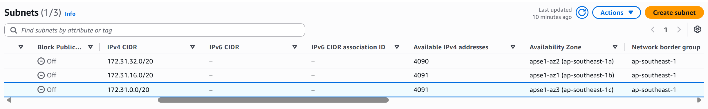
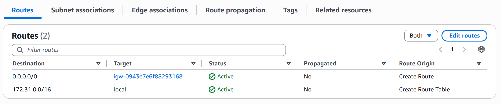
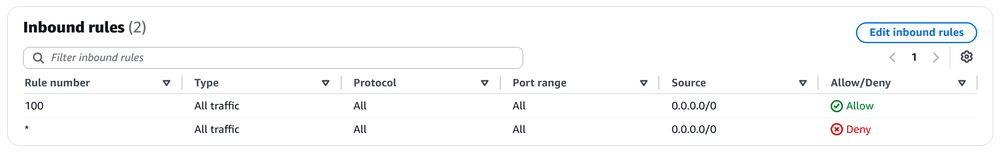
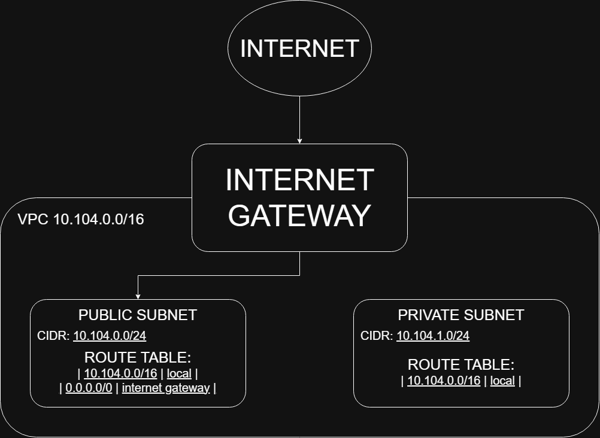

# Assignment 2 Submission

<!--
How to use this template:

1. Copy this file to submissions/assignment-2/<your-github-username>/submission.md
2. Replace every answer placeholder with your own answer. Delete the angle brackets too.
3. Save your four images in the same folder, with the exact file names below.
4. Do not write your full name or your student number in this file.
-->

## About me

- GitHub username: micasanf
- Section: IV - DCSAD
- IAM user name that I signed in with: dcsad-g06
- X: 104

---

## Part A. Explore

### A1. The VPC

Default VPC IPv4 CIDR:

172.31.0.0/16

Number of addresses in that CIDR:

65,536

### A2. The subnets

|       Availability Zone       |     IPv4 CIDR    |
| --- | --- |
| `apse1-az2 (ap-southeast-1a)` | `172.31.32.0/20` |
| `apse1-az1 (ap-southeast-1b)` | `172.31.16.0/20` |
| `apse1-az3 (ap-southeast-1c)` | `172.31.0.0/20`  |

Screenshot 1. Save it as `screenshot-1-subnets.png` in your folder. The image line below shows it.

### A3. Available addresses

Available IPv4 addresses in each subnet:

`ap-southeast-1a` 4,090, `ap-southeast-1b` 4,091, `ap-southeast-1c` 4,091.

Why is the number lower than 4,096?

A /20 subnet has four thousand and ninety-six addresses in total because a /20 leaves twelve bits and 2^12 equals four thousand and ninety-six. However not all of these addresses can be given to instances. AWS reserves five addresses in every subnet. The first four addresses and the last one are reserved. In AWS these are used for the network address, the VPC router, the DNS server, an address kept for use and the broadcast address. For example in the subnet 172.31.32.0/20 the reserved addresses are 172.31.32.0 to 172.31.32.3. The last address, 172.31.47.255. Instances cannot use any of them. This means even an empty subnet has four thousand and ninety-six minus five equals four thousand and ninety-one addresses, which is what two of my subnets show. The subnets are ap-southeast-1b. Ap-southeast-1c. The third subnet, ap-southeast-1a shows four thousand and ninety-zero because one more address is already being used by a network interface in that subnet. So the number is than four thousand and ninety-six mainly because of the five reserved addresses and the subnet with the lowest number has one extra address, in use.

What uses the missing address in the subnet with the lowest number?

The subnet with the number is ap-southeast-1a (172.31.32.0/20) and it shows 4,090 available addresses. The other two subnets show 4,091 addresses. That number matches what an empty subnet would have. 4,096 Addresses minus 5 reserved ones. So ap-southeast-1a has one available address than the others. That means one address is being used in that subnet.

An address in a subnet is assigned to a network interface. That’s the network card attached to an instance. The network interface keeps its IP address even if the instance is stopped. So even if an instance is stopped it still holds onto one address in the subnet.

This means one network interface in ap-southeast-1a is using that missing address. It’s most likely, from an EC2 instance that was launched in the default VPC.

### A4. The route table

|     Destination      |            Target          |
| --- | --- |
|     `0.0.0.0/0`      | 	`igw-0943e7e6f88293168` |
|   `172.31.0.0/16`    |           `local`          |

Screenshot 2. Save it as `screenshot-2-routes.png` in your folder. The image line below shows it.

### A5. Public or private

Are the default subnets public or private? Which route proves it?

The default subnets are public. The route 0.0.0.0/0 in the route table has the internet gateway (igw-...), as its target. The destination 0.0.0.0/0 matches every address so all traffic that does not match another route goes to the internet gateway. A subnet whose route table has this route is a subnet. The three default subnets do not have their route table. They use this route table automatically so all three are public.

### A6. The internet gateway

State of the internet gateway:

Attached

What happens to the default subnets if the gateway is detached?

If the internet gateway is disconnected from the VPC, the route 0.0.0.0/0 no longer has a working target. The default subnets lose their way to the internet so instances in those subnets can no longer connect to the internet. The internet can no longer connect to them even if they have public IP addresses. The subnets would stop being public because a subnet is public when its route table sends 0.0.0.0/0 to a working internet gateway. Instances, in the VPC can still communicate with each other because the local route (172.31.0.0/16) is not affected.

### A7. NAT gateways

Number of NAT gateways:

0, No NAT gateways found

Can a server in a new private subnet download updates? Why?

No, not yet. A new private subnet would use a route table that has the local route so it does not have a route to the internet gateway. A server in that subnet could communicate with servers, in the VPC but it could not send traffic to the internet. To download updates the server needs a NAT gateway. A NAT gateway would have to be created in a subnet and the private subnets route table would need a route 0.0.0.0/0 that points to the NAT gateway. This VPC does not have a NAT gateway. The server cannot download updates until a NAT gateway is added.

### A8. The network ACL

| Rule number  |    Source   | Allow or Deny |
| --- | --- |
|     100      | `0.0.0.0/0` | Allow         |
|      `*`     | `0.0.0.0/0` |          Deny |

How is a network ACL different from a security group?

A network ACL acts like a firewall for a subnet. A security group works as a firewall for a resource like an EC2 instance. The network ACL uses both allow rules and deny rules.. A security group only uses allow rules.

The network ACL is stateless, which means that if traffic goes out the return traffic must have its own rule to be allowed. A security group is stateful so the reply traffic automatically goes through without needing a rule.

Network ACLs check rules in order, by number starting from the lowest. It stops at the rule that matches. Security groups evaluate all their rules together.

In my default network ACL rule 100 allows all traffic from 0.0.0.0/0. That means it does not block any outgoing traffic.

Screenshot 3. Save it as `screenshot-3-network-acl.png` in your folder. The image line below shows it.

### A9. The default security group

Inbound rule (type and source):

All traffic, from `sg-0c5b6d4081cf0a534`. The source is the `default` security group itself.

Which resources can send traffic to an instance that uses it?

Only resources that also use the default security group can send traffic to the instance. The only inbound rule allows all traffic. Its source is the default security group itself not an address range such as 0.0.0.0/0. A security group has only allow rules and blocks all traffic that no rule permits, so traffic from any source, including the internet is blocked. This means an instance that uses only this security group cannot be reached from my laptop. The default security group only lets resources in the same default security group talk, to each other.

---

## Part B. Prepare

### B1. Plan two subnets

- Public subnet CIDR: `10.104.0.0/24`
- Private subnet CIDR: `10.104.1.0/24`

### B2. Route tables

Route table of the public subnet:

|   Destination   |       Target       |
| `10.104.0.0/16` |       `local`      |
|   `0.0.0.0/0`   | `internet gateway` |

Route table of the private subnet:

|   Destination   |  Target  |
| `10.104.0.0/16` | `local`  |

### B3. My VPC diagram

Tool used (Excalidraw, draw.io, Lucidchart, or paper):

draw.io

Save your diagram as `vpc-diagram.png` in your folder. The image line below shows it.

### B4. Predict a change

Can you still open the web page from your laptop? Why?

No. My laptop is connected to the internet. The instance lives in a default subnet. If the route 0.0.0.0/0 is removed from the default route table traffic between the instance and internet addresses has no path to follow because the path, to the internet gateway is missing. The public IP address of the instance is not sufficient so the web page cannot be opened from my laptop.

Can the instance still reach another instance in the VPC? Why?

Yes. The local route (172.31.0.0/16) is still in the route table. Deleting 0.0.0.0/0 does not remove it. The local route connects every subnet, in the VPC. That means the instance can still reach instances in the same VPC.

### B5. Place a database

Which subnet gets the database? Why?

I was looking at the subnet 10.104.1.0/24 and I saw that the route table contains only the local route. The route table does not have a route to the internet gateway. No host on the internet can reach the database. The servers inside the VPC such as the web server, in the subnet still can reach the database through the local route.

### B6. My question about VPCs

What is your question, and what made you think of it?

If a stopped instance still holds one address in its subnet what will happen to that address after the instance is terminated? I wondered about this because my ap-southeast-1a subnet listed 4,090 addresses, one fewer, than the other two subnets so I asked when the address gets returned.
